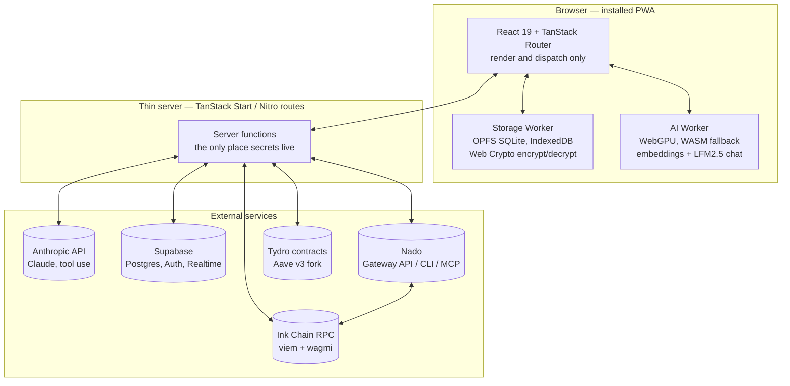
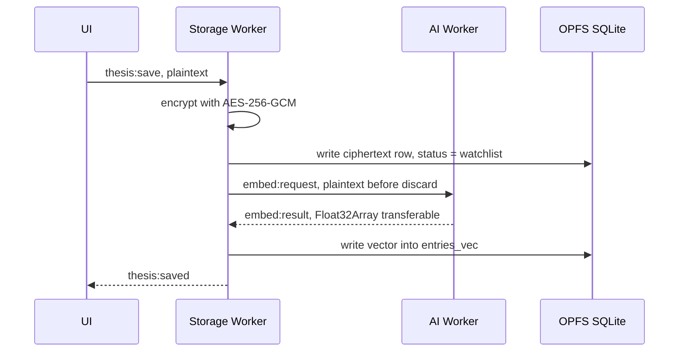
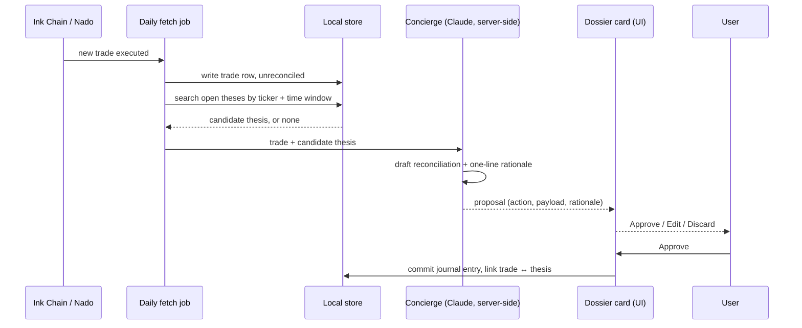

# Dynaminko — ROADMAP AND IMPROVEMENT Plans

**Vision → Architecture → Roadmap → Build Instructions, unified**

## 1. Concept, in one page

Dynaminko is a thesis-first trading journal and terminal for Ink chain, built around a single behavioral bet: **journaling fails as bookkeeping, and succeeds as a habit loop**  A trading journal isn't a data problem — the ledger already exists onchain. It's a retention problem, the same one Duolingo solved for language learning: the lesson isn't the product, the thing that gets you to open the app on a day you had no intention of is the product.

So Dynaminko inverts the normal build order. Most journals ship analytics first and hope for habit second. we focus on the trigger first and analytics catch up.

**The mechanism — three input layers, one schema:**

| Layer | Trigger | Effort | Value |
|---|---|---|---|
| Manual | User-initiated, any time | Highest | Captures the *why* before an outcome exists to bias it |
| Auto-fetched | Daily job → later live via Nado | None | Removes accounting labor entirely |
| AI-assisted | thesis or Trade event fires | Lowest | Turns raw ledger rows into narrative |

A thesis written with no position open sits in a "watchlist of intent" ideally on the theses tab only, until a matching trade appears — at which point the system stitches them together **and asks before it writes anything**. That confirm-before-write discipline (add trade, confirm thesis, and the due sequence of question to answer will pop up in order to unify the thesis, jornal, trade, sentiment and the all the performance engine metrics) is the one interaction pattern that repeats everywhere in this app: the Dashboard concierge feed, the Theses reconciliation timeline, and the AI capable Terminal all resolve to the same dossier card.

**The surface it trades:** seven curated, high-conviction tokenized sector baskets — crypto assets and xstocks that break down into : Privacy, Store of Value, Health, Defense, memes, Metals, AI — rather than an open-ended "journal whatever you trade" tool.

**The tone it refuses to have:** this is not a wellness app that happens to track trades, Dynaminko reads as a classified trading terminal: onyx and obsidian surfaces, hairline borders, one accent color, restraint as the actual differentiator against a more decorated competitor 

**What it's built on:** Ink chain (Kraken's OP Stack L2, chain ID `57073`, live and growing since December 2024), trading through Nado (a unified spot/perp/margin CLOB with its own CLI, MCP server, and Builder Code fee-share program),swaps on inkyswap and velodrome or via 1 aggregator, earning yield through Tydro.

---

## 2. Product pillars — dos and don'ts

### Design

| Do | Don't |
|---|---|
| Onyx `#0A0A0C` background, Obsidian `#151318` panels, Hairline `#2A2830` 1px borders only, Lavender `#B6A5F0` as the *single* accent | Default to shadcn's rounded cards + drop shadows anywhere. No drop shadows in this app, full stop |
| Signal Mint `#4FF7B4` for gains, Muted Rose `#C97C74` for losses | Use pure red for losses, or fill/background lavender anywhere but buttons, active nav, focus rings |
| IBM Plex Sans for UI text, IBM Plex Mono for **every** number, ticker, timestamp, terminal line | Let a numeral render in the sans face, anywhere, ever |
| Uppercase, wide-tracked (0.05–0.1em) eyebrows on section labels and status only | Extend the uppercase/tracked treatment to anything else — it's the one flourish |
| Scope the **dossier card** (hairline border, monospace case-file header, clipped-corner tick) to exactly three surfaces: sector baskets, thesis entries, trade confirmations | Let the dossier treatment spread to a fourth surface — restraint is the point |
| Scope **diamondmorphism** (faceted, hard-edged, gemstone-like) to exactly three moments: boot sequence centerpiece, Dashboard portfolio 3D form, the logo mark | Use soft gaussian blur / generic glassmorphism on ordinary panels, or let diamondmorphism wash across the UI |
| Keep nav to lean ; keep quick capture to three actions | Crowd nav past six, or quick capture past three, "to feel more feature rich" — the competitor already made that mistake |

### Product & behavior

| Do | Don't |
|---|---|
| Ship the capture trigger (Phase 0–1) before the insight engine (Phase 3–4) | Bundle wallet connect + dual AI agents + Dynamic Performance into one "current focus" phase — that's exactly the inverted build order the product thesis exists to avoid |
| Make quick capture reachable in ≤1 tap from any screen, and measure it | Assume the 10-second capture bar is met — it's an exit criterion, not a given |
| Let one sentence, one tag, or one voice note count as a complete entry | Require a filled form for a valid entry |
| Trigger reflection from the trade event itself | Schedule reflection on a timer — a calendar reminder competes with every other notification; a trade-triggered prompt doesn't |
| Auto-park idle "watchlist of intent" capital in Tydro once a wallet is linked| Let capital sit idle by default once the plumbing exists to avoid it |

### AI & concierge

| Do | Don't |
|---|---|
| Propose, then confirm, for every write — thesis, trade log, alert. Always a dossier card with Approve / Edit / Discard | Let any AI surface (Dashboard feed, Theses, AI Terminal) write silently, ever, at any phase |
| Queue an event when AI can't assist live, and resolve it in a daily batch `[Vision §4]` | Drop a trade event because no live session was open |
| Keep the deterministic reconciliation concierge and the (optional, later) sentiment/community-signal agent as separate subsystems `[Lovable — architecture note]` | Conflate the two — they have different trust levels and different failure modes |
| Mirror Nado's own confirmation discipline (gather context → present summary → ask → execute) for anything that touches money `[Nado MCP/CLI docs, §4.6]` | Treat a user's *initial* request as confirmation — Nado's own docs are explicit that it isn't, and Dynaminko should hold the same line |

### Technical

| Do | Don't |
|---|---|
| Local-first by default; encrypt entry content before it touches disk | Wire Supabase, wallet connect, or any live chain/exchange call in Phase 0 — mock data only, per `[UI]`'s explicit non-goals |
| Default to TypeScript; reach for Rust/WASM only where a specific hot path is benchmarked `[Arch §3]` | Commit to a Rust/WASM core up front on the assumption it'll be needed |
| Keep any cloud LLM key server-side, never in the client bundle | Call the Anthropic API (or any provider) directly from PWA client code with an embedded key |
| Default to read-only wallet connect; use Nado Linked Signer hot keys for any later execution | Ever ask for, store, or transmit a user's main wallet private key, client or server side |

---

## 4. System architecture

### 4.1 Stack at a glance

| Layer | Pick | Status |
|---|---|---|
| App framework | TanStack Start (React 19.2, TanStack Router, Vite 8, Nitro server runtime) | ✅ in `[Repo]` |
| Styling | Tailwind CSS v4 (CSS-native `@theme`, via `@tailwindcss/vite`) + shadcn/ui (full Radix primitive set already installed) | ✅ in `[Repo]` — needs Dynaminko token override, see below |
| Forms & validation | `react-hook-form` + `@hookform/resolvers` + `zod` | ✅ in `[Repo]` — build the canonical schema (§4.4) on top of this |
| Command palette | `cmdk` | ✅ in `[Repo]` — exact fit for the quick-capture panel |
| Charts | `recharts` | ✅ in `[Repo]` — covers the flat pie fallback and category-exposure bars; the 3D diamondmorphism form itself needs custom WebGL/CSS-3D, not recharts |
| PWA tooling | `vite-plugin-pwa` (Workbox) | ❌ **not yet installed** — action item, §9 |
| Local persistence | SQLite→WASM + `sqlite-vec`, in OPFS; IndexedDB for lightweight tags/prefs | ❌ not yet wired (Phase 1) |
| Encryption | AES-256-GCM via Web Crypto, PBKDF2-derived key, optional WebAuthn PRF unlock | ❌ not yet wired (Phase 1) |
| On-device AI | Transformers.js + WebGPU (WASM fallback): `all-MiniLM-L6-v2` embeddings, `LFM2.5-1.2B-Instruct-ONNX` chat | ❌ not yet wired (Phase 2) |
| Cloud AI | Claude via the Anthropic Messages API, tool use, called from a server function only | ❌ not yet wired (Phase 2) |
| Cloud sync | Supabase (Postgres + Auth + Realtime) | ❌ deferred, per `[UI]`'s explicit Phase 0 non-goal (Phase 2+) |
| Chain / wallet | `viem` + `wagmi`; `chains/ink.ts` wraps viem's built-in `ink` chain export rather than hand-defining it | ❌ not yet wired (Phase 1) |
| Trading integration | Nado: Gateway REST API (backend reads/writes), CLI `@nadohq/nado-cli` (scripts/ops), MCP server `@nadohq/nado-mcp` (AI tool-calling layer) — three surfaces, three jobs, see §4.6 | ❌ not yet wired (Phase 1 read-only → Phase 5 execution) |
| Lending integration | Tydro (white-label Aave v3 on Ink) — contract reads/writes via viem, or Tydro's own SDK if published; check `docs.tydro.com` when this phase starts | ❌ not yet wired (Phase 3 read-only → Phase 5 write) |
| Package manager | Bun (`bun.lock`, `bunfig.toml` present) | ✅ in `[Repo]` — README needs to stop saying npm, §3.8 |

The framework choice matters more than it looks: `[Arch]` assumed a plain Vite + React SPA. The repo is actually **TanStack Start**, which is Vite-based (so `vite-plugin-pwa` should still apply) but SSR-capable via Nitro. That's a genuine asset, not a complication — it means there's already a natural home for the one piece this architecture actually needs on a server: routes that hold secrets (the Anthropic API key, any cached Nado linked-signer key) without standing up a separate service. Recommendation: keep the local-first client core exactly as `[Arch]` describes it (workers, OPFS, encryption are pure browser concerns regardless of SSR), and use TanStack Start server functions specifically for the handful of things that must not run in the client — see §4.5 and §4.6.

### 4.2 System diagram



Notice what's not in the center : React isn't the architecture, it's a view over workers and a thin server that behave like small internal services.

### 4.3 Two flows worth tracing

**Capturing a thesis** (Manual or AI-Assisted, no trade yet):



**A trade is fetched and reconciled** — the pattern that repeats on the Dashboard feed, the Theses timeline, and the AI Terminal alike:



If AI can't assist live (no session, model unavailable), the event queues rather than drops, and this same flow runs as a daily batch instead `[Vision §4]`.

### 4.4 Canonical data model

 is explicit that the schema has to support all three input layers and all five Dynamic Performance axes starting in Phase 0, even though the UI only exposes one or two axes at first — retrofitting axes onto live data later is exactly the kind of fix the project exists to avoid. Since this can be a real, typed schema from day one, not a future migration:

```ts
// src/schema/entities.ts
import { z } from "zod";

export const SectorBasket = z.enum([
  "privacy", "store_of_value", "health", "defense",
  "firearms_guns", "semiconductors", "ai",
]);

export const ThesisCaptureMode = z.enum(["manual", "ai_assisted"]); // Theses composer toggle
export const ValidationStatus = z.enum(["pending", "aligned", "drifted"]);

export const ThesisSchema = z.object({
  id: z.string().uuid(),
  ticker: z.string().nullable(),        // null = sector-level thesis, not ticker-specific
  sector: SectorBasket,
  captureMode: ThesisCaptureMode,
  inputChannel: z.enum(["text", "voice", "image"]).default("text"), // Phase 2 adds voice/image, §3.2
  body: z.string(),
  createdAt: z.string().datetime(),
  updatedAt: z.string().datetime(),
  lastReviewedAt: z.string().datetime().nullable(),  // drives the staleness badge
  status: z.enum(["watchlist", "reconciled", "retired"]),
  linkedTradeIds: z.array(z.string().uuid()).default([]),
});

export const TradeSchema = z.object({
  id: z.string().uuid(),
  ticker: z.string(),
  sector: SectorBasket,
  side: z.enum(["buy", "sell", "long", "short", "swap"]),
  venue: z.literal("nado"),
  price: z.number(),
  size: z.number(),
  notional: z.number(),
  pnl: z.number().nullable(),
  executedAt: z.string().datetime(),
  fetchedAt: z.string().datetime(),
  reconciledThesisId: z.string().uuid().nullable(),
  reconciliationStatus: ValidationStatus,
});

// All five Dynamic Performance axes, modeled from Phase 0 — most fields stay null
// until the phase that populates them ships. [Vision §6, §8]
export const PerformanceAxesSchema = z.object({
  performance: z.object({
    pnl: z.number(), rMultiple: z.number().nullable(), drawdown: z.number().nullable(),
  }).nullable(),
  thesis: z.object({ aligned: z.boolean().nullable() }).nullable(),
  sentiment: z.object({
    score: z.number().min(-1).max(1).nullable(),
    source: z.enum(["self_reported", "external_feed"]).nullable(),
  }).nullable(),
  financial: z.object({
    sizePctOfPortfolio: z.number().nullable(), leverage: z.number().nullable(),
  }).nullable(),
  psychological: z.object({
    entryTag: z.string().nullable(), exitTag: z.string().nullable(),
  }).nullable(),
});

// Backs every dossier "Approve / Edit / Discard" card, everywhere it appears.
export const ConciergeProposalSchema = z.object({
  id: z.string().uuid(),
  action: z.enum(["new_thesis", "trade_log", "alert", "reconciliation"]),
  payload: z.record(z.unknown()),   // shape depends on `action`; re-validated against
                                     // the target schema above at Approve time
  rationale: z.string(),            // the one-line "why" shown on the card
  state: z.enum(["proposed", "approved", "edited_and_approved", "discarded"]),
  createdAt: z.string().datetime(),
  resolvedAt: z.string().datetime().nullable(),
});

export const AlertSchema = z.object({
  id: z.string().uuid(),
  kind: z.enum(["price", "onchain_event", "thesis_validation_nudge"]),
  ticker: z.string().nullable(),
  condition: z.record(z.unknown()),
  active: z.boolean(),
  createdAt: z.string().datetime(),
});
```

Treat this as a starting sketch to refine, not a migration-ready final spec — but it already satisfies the "all layers, all axes, from Phase 0" requirement, and it compiles against what's already installed.

### 4.5 AI concierge architecture

Per §3.3's resolution, this is a hybrid, and the two halves should never share a trust boundary:

- **On-device (client, WebGPU/WASM):** `all-MiniLM-L6-v2` embeddings for semantic search over a user's own entries, and `LFM2.5-1.2B-Instruct` (drop to smaller LFM like `-450M VL` for a lighter footprint and vision) for the guided, conversational side of AI-Assisted thesis capture. Cheap, private, offline-capable, and — critically — never sees a user's trade data leave the device for this particular job.
- **Cloud (server-only, Claude code, ollama cloud, openrouter via aoauth or api):** AI Terminal command interpretation and trade-thesis reconciliation drafting, where the output has to reliably match a schema (§4.4) and the reasoning is worth paying latency for. This must run behind a server function — never a client-side key.
- focused on read data and thesis  answer and propose changes or improvements on the trade or thesis based on new data ( not on trading itself, it will be able in the last phase)

A minimal server-side route, using tool use to force a schema-shaped response:

```ts
// src/server/concierge.ts — runs only on the server, never bundled to the client
import Anthropic from "@anthropic-ai/sdk";

const anthropic = new Anthropic(); // reads ANTHROPIC_API_KEY from server env only

const reconciliationTool = {
  name: "propose_reconciliation",
  description: "Propose linking a fetched trade to an open thesis, or logging a standalone entry.",
  input_schema: {
    type: "object",
    properties: {
      action: { type: "string", enum: ["reconciliation", "new_thesis", "trade_log", "alert"] },
      thesisId: { type: "string", nullable: true },
      tradeId: { type: "string", nullable: true },
      rationale: { type: "string", description: "One or two sentences, shown on the dossier card" },
      validationStatus: { type: "string", enum: ["aligned", "drifted", "pending"] },
    },
    required: ["action", "rationale"],
  },
};

export async function draftProposal(trade: unknown, candidateThesis: unknown) {
  const response = await anthropic.messages.create({
    model: "claude-sonnet-5",  // claude-haiku-4-5-20251001 for lighter/cheaper interpretation tasks
    max_tokens: 512,
    tools: [reconciliationTool],
    tool_choice: { type: "tool", name: "propose_reconciliation" },
    messages: [{
      role: "user",
      content: `Trade: ${JSON.stringify(trade)}\nCandidate thesis: ${JSON.stringify(candidateThesis)}\nDraft a reconciliation proposal.`,
    }],
  });

  const toolUse = response.content.find((b) => b.type === "tool_use");
  return toolUse?.input; // validate against ConciergeProposalSchema before it ever reaches the client
}
```

Verify current model names and tool-use syntax at `platform.claude.com` before shipping this — check the `product-self-knowledge` reference rather than trusting memory here, same as this document did.

**The dual-agent split** `[Lovable]`'s architecture note first raised — a deterministic concierge for journaling accuracy, plus a separate sentiment/community agent for external mood — is worth keeping, but on a later phase: fold it into the *thesis-trade reconciliation* concierge above for Phase 2, and stand up the sentiment agent as its own subsystem in Phase 4, once the Sentiment axis is actually being populated (§6). They shouldn't share a code path — one is writing to a user's ledger, the other is reading public chatter.

### 4.6 Chain, Nado, and Tydro integration

Nado exposes **three** integration surfaces, and each maps to a different part of this stack — don't collapse them into one:

| Surface | Best for | Notes |
|---|---|---|
| Gateway REST API | Dynaminko's own backend — the daily fetch job, live market data, order placement | Referenced under `developer-resources/api/gateway/` in Nado's docs (e.g. Place Order); review the full reference when Phase 1/5 integration starts — no subprocess management needed |
| CLI (`@nadohq/nado-cli`) | Manual ops, quick scripts, testnet exploration | ~40 commands / 8 groups; JSON or table output (`--format json`/`table`); every write command shows a confirmation summary, `-y` to skip for automation, `--dry-run` to preview |
| MCP server (`@nadohq/nado-mcp`) | The AI Terminal's tool-calling layer specifically | ~50 tools; runs **locally as a subprocess over stdio** — this has to live on Dynaminko's own backend (spawned by a server function), never in-browser, since browsers can't spawn child processes |

The AI Terminal's slash commands (`/market`, `/account`, `/trade (only the user)`, `/funds ( transfering funds only the user)`) map exactly onto four of Nado's eight CLI command groups — that's not a coincidence, and the fit is worth keeping deliberate: the other four groups (`nlp` — Nado's own native liquidity vault, distinct from Tydro, don't conflate them; `auth`, `setup`, `shell`) are one-time bootstrapping or raw REPL access, and belong in Settings rather than the in-app terminal.

**Custody ladder** — resolves open question:

1. **Read-only** (Phase 1–2): wallet connect only, zero key material, all query tools work — market data, account info, history.
2. **Linked Signer** (Phase 5+, execution): a disposable hot key authorized to sign on the main wallet's behalf. It can place/cancel/modify orders, set TP/SL/TWAP triggers, withdraw collateral, transfer between subaccounts — but it **cannot** withdraw collateral or link/revoke signers, both of which require the main wallet's own signature. If it's ever compromised, revoke it instantly by calling `link_signer` with the zero address. This is Nado's own recommended pattern, and Dynaminko should never ask for anything stronger.
3. Dynaminko's own servers or client storage never hold a user's main wallet private key, at any phase.

Confirmation discipline carries through unchanged: Nado's own MCP server enforces "gather context → present summary → ask for explicit approval → execute," and states plainly that an initial request ("long BTC with 0.01") is *not* confirmation. Dynaminko's Approve/Edit/Discard dossier card is the UI for exactly this flow — build it once, reuse it for thesis writes, trade logs, alerts, and (in Phase 5) real order placement alike.

**Monetization** : Nado's Builder Code program lets a routed-volume interface earn a fee share automatically. Concretely: apply for a Builder ID via Nado's registration form, embed it (and a fee rate, in 0.1bps units) into the order appendix on every routed order, activate a builder subaccount with a minimum $5 deposit, then periodically check `getClaimableBuilderFee` on the OffchainExchange contract (`0x8373C3Aa04153aBc0cfD28901c3c971a946994ab` on Ink) and claim via a `ClaimBuilderFee` transaction before withdrawing normally. This is the mechanism that turns Dynaminko from a pure cost center into something whose revenue scales with in-app trading volume, exactly as `[Vision]` frames it.

**Chain config:** don't hand-roll `chains/ink.ts` from scratch — Nado's own TypeScript examples import `ink` directly from `viem/chains`. Wrap that, adding only Dynaminko-specific overrides (custom RPC endpoint, if any), so chain metadata stays maintained upstream rather than drifting out of sync.

**Tydro** (Vault page, Phase 3 read / Phase 5 write): a live, non-custodial, white-label Aave v3 deployment on Ink, currently supporting assets like wETH, kBTC, USDG, USDT0, GHO, USDC, and USDe. Standard Aave-v3-shaped contract calls via `viem` should work; check `docs.tydro.com` for whether Tydro publishes its own SDK before hand-rolling ABI calls.

---

## 5. Final state — the north star

This is what "done" looks like, across every phase below — the thing every phase gate in §6 is building toward:

- A user connects a wallet **read-only** and watches their real Ink chain / Nado activity flow into the ledger automatically — zero manual data entry, ever.
- A thesis gets captured in under 10 seconds, from any screen, in whichever mode fits their mood — typed, voice, guided AI chat — and one sentence is a complete, valid entry.
- Every fetched trade gets matched against an open thesis (or flagged thesis-less) by the concierge, rendered as a dossier card, and **never written without an explicit Approve**.
- Trades in the seven curated sector baskets execute in-app through Nado (spot / perp / swap), still behind the same Approve/Edit/Discard gate, funding Dynaminko directly through its Builder Code fee share.
- Idle "watchlist of intent" capital auto-parks in Tydro rather than sitting flat, reinforcing patience as a rewarded behavior rather than a cost `[Vision §9]`.
- The Dynamic Performance view shows all five axes once sample size supports it, with thesis-aligned vs. thesis-less win rate as the flagship, spreadsheet-can't-show-you-this stat.
- Alerts — price, on-chain event, thesis-staleness — nudge without tipping into manipulative; where that line sits is a decision made deliberately (§9), not drifted into.
- The whole thing installs as a PWA, works offline, encrypts entry content at rest, and pairs a private on-device model for everyday reflection with a more capable cloud concierge for the moments that need it.
- If the INKO-branded, low-stakes distribution wedge still makes sense by Phase 5, it's a go-to-market choice made on real data from Phases 0–4 — not a rebrand decided today.

---

## 6. Roadmap — Phases 0–6

check it on : 

