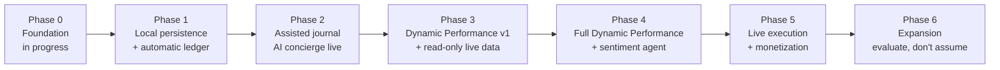

### Phase 0 — Foundation (in progress — this is `[UI]`)

**Goal:** prove the aesthetic differentiation and the retention trigger before any real data exists.
**Deliverables:** boot sequence (plays once/session, respects reduced motion); six-item nav (desktop sidebar, mobile bottom bar); three-action quick capture; Dashboard (diamondmorphism 3D portfolio form + flat-pie reduced-motion fallback, category exposure bars, mock concierge feed); Markets (seven sector tabs, one fixture asset each, CLOB-style order panel, mock order book); AI Terminal (slash commands, JSON/table toggle, mock proposal cards); Theses (dossier list/detail, Manual/AI-Assisted toggle, staleness badge); Vault (Tydro-style mock supply/borrow cards); Settings (wallet placeholder, notification prefs, mock alert setup). All fixture data — no live anything, per `[UI]`'s explicit non-goals.
**Exit criteria:** a thesis note captured in under 10 seconds from any screen, **measured**, not assumed `[Vision §10]`; all six pages reachable; dossier card scoped to exactly three surfaces, diamondmorphism to exactly three moments — no more, no less.
**Effort:** L (this is most of what's already been prompted for; remaining effort is finishing + polish).

### Phase 1 — Local persistence & automatic ledger

**Goal:** make Phase 0's screens real, and remove manual trade entry entirely.
**Deliverables:** SQLite-WASM + `sqlite-vec` in OPFS behind a Storage Worker; IndexedDB for lightweight prefs; AES-256-GCM encryption with passphrase (+ optional WebAuthn PRF unlock); the canonical schema (§4.4) replacing fixtures; read-only wallet connect (`viem`/`wagmi`, `chains/ink.ts`); a daily fetch job pulling trade history via Nado's Gateway API or CLI (read-only, zero key material); token+time-window thesis-to-trade matching, with an explicitly decided acceptable error rate (§9 — this was flagged open in `[Vision §11]` and needs a real answer before this phase ships).
**Exit criteria:** every trade on the connected wallet appears in the ledger with zero manual input; a standalone thesis survives a reload and reconciles correctly once a matching trade is fetched; the app works fully offline after first load.
**Effort:** L–XL (this is the architectural foundation everything else sits on).
Have in mind local storage for agent is diferent from local storage for our data and trades

### Phase 2 — Assisted journal

**Goal:** turn the ledger into narrative without ever opening a form.
**Deliverables:** on-device AI Worker (embeddings + LFM2.5 guided capture, lazy-loaded behind an explicit action, never on cold start); the server-side concierge route (§4.5) for reconciliation drafting; event-driven live prompts + daily batch fallback; dossier proposals that actually commit on Approve; staleness badge logic feeding the Theses nav count.
**Exit criteria:** most new trades get a linked reflection without a form; AI unavailability never drops an event, it queues.
**Effort:** L.

### Phase 3 — POT Performance v1 + read-only live data

**Goal:** ship the first real insight, and make Markets/Vault show real numbers (still no execution).
**Deliverables:** Performance + Thesis axes combined into one composite view, thesis-aligned vs. thesis-less win rate as the flagship stat; live Nado market data (price, orderbook, candles — read-only) replacing Markets fixtures; live Tydro APY data (read-only) replacing Vault fixtures; real balances behind the privacy toggle.
**Exit criteria:** the composite view surfaces at least one insight a spreadsheet couldn't; still zero custody risk beyond read-only connect.
**Effort:** M.

### Phase 4 — Full POT Performance + sentiment agent

**Goal:** populate the remaining three axes.
**Deliverables:** the sentiment agent as its own subsystem (§4.5) ingesting external community/market signal; financial-risk axis from real Nado account data (size %, leverage); one-tap psychological self-report tags (entry + exit); the composite five-axis graph.
**Exit criteria:** all five axes populate for active users with enough sample size to matter.
**Effort:** M–L.

Have clear work flow, agent assistance and ability to read, resume and do some tool calls withing the app

### Phase 5 —

Live execution & monetization

**Goal:** move from tracking to executing, and turn the product into a funded one.
**Deliverables:** Linked Signer onboarding (generate/link a scoped hot key, clear instant-revoke messaging, main wallet key never touched); live order placement (Buy Spot / Go Long / Swap) behind the same Approve/Edit/Discard gate used everywhere else; Nado Builder Code registration + fee-share integration (§4.6); live Tydro supply/borrow with auto-park for idle watchlist capital; optional INKO-branded launch as the initial distribution wedge, if §9's data supports it.
**Exit criteria:** a user goes thesis → executed trade → journaled entry without leaving the app; Builder fee claims are verifiably nonzero.
**Effort:** XL.

**Goal:** decide the next move from real Phase 0–5 data, not upfront guesses — this phase is deliberately not scoped further here.
**Candidates to evaluate:** a native Tauri shell reusing the same local-first core (per `[Arch §11]`'s prior-project lineage note); chains beyond Ink; white-label/B2B; personalized local trading agents trained on a user's own history (`[Lovable]`'s "Advanced Vaults" idea, if it still holds up).

---

## . Tech stack reference

### Confirmed vs. to-be-added

| Category        | Confirmed in `[Repo]`                                                                                                                            | To add, by phase                                                        |
| --------------- | ------------------------------------------------------------------------------------------------------------------------------------------------ | ----------------------------------------------------------------------- |
| Framework       | TanStack Start `^1.168.26`, TanStack Router `^1.170.16`, React `^19.2.0`, Vite `^8.0.16`, Nitro `3.0.260603-beta`                                | —                                                                       |
| Styling         | Tailwind v4 `^4.2.1` (`@tailwindcss/vite`), shadcn/ui (full Radix set), `class-variance-authority`, `tailwind-merge`, `tw-animate-css`           | Dynaminko token override (§2 palette/type as CSS `@theme` vars)         |
| UI utilities    | `cmdk`, `vaul`, `sonner`, `recharts`, `embla-carousel-react`, `lucide-react ^0.575.0`, `react-day-picker`, `react-resizable-panels`, `input-otp` | —                                                                       |
| Forms           | `react-hook-form`, `@hookform/resolvers`, `zod`                                                                                                  | canonical schema (§4.4)                                                 |
| PWA             | —                                                                                                                                                | `vite-plugin-pwa` (Phase 0/1 — verify Nitro build-output compatibility) |
| Local data      | —                                                                                                                                                | SQLite-WASM + `sqlite-vec` in OPFS, Web Crypto (Phase 1)                |
| On-device AI    | —                                                                                                                                                | `@huggingface/transformers`, WebGPU/WASM (Phase 2)                      |
| Cloud AI        | —                                                                                                                                                | `@anthropic-ai/sdk`, server-side only (Phase 2)                         |
| Backend/sync    | —                                                                                                                                                | `@supabase/supabase-js` (Phase 2+)                                      |
| Chain           | —                                                                                                                                                | `viem`, `wagmi` (Phase 1)                                               |
| Package manager | Bun (`bun.lock`, `bunfig.toml`)                                                                                                                  | fix README (§3.8, §9)                                                   |

### Ink chain, Nado, Tydro — verified technical reference

| Property                                | Value                                                              |
| --------------------------------------- | ------------------------------------------------------------------ |
| Network                                 | Ink Chain (Kraken, OP Stack, Optimism Superchain)                  |
| Mainnet chain ID                        | `57073`                                                            |
| Testnet                                 | Sepolia Ink, chain ID `763373`                                     |
| Native currency                         | ETH                                                                |
| Explorer                                | `https://explorer.inkonchain.com`                                  |
| RPC (examples)                          | `https://rpc-gel.inkonchain.com`, `https://rpc-qnd.inkonchain.com` |
| Nado CLI                                | `@nadohq/nado-cli` (npm/bun); `nado market                         | account | trade | funds | nlp | auth | setup | shell` |
| Nado MCP                                | `@nadohq/nado-mcp`, local stdio subprocess, ~50 tools              |
| Nado OffchainExchange contract          | `0x8373C3Aa04153aBc0cfD28901c3c971a946994ab` (Ink)                 |
| Nado Builder application                | `https://tally.so/r/0QO4oy`                                        |
| Tydro docs                              | `https://docs.tydro.com`                                           |
| Tydro supported assets (as of mid-2026) | , wETH, kBTC, USDG, USDT0, GHO, USDC, USDe                         |

Structure `chains/ink.ts` as a thin wrapper over viem's built-in `ink` export (`import { ink } from "viem/chains"`) rather than hand-defining it, per §4.6.

---

## 8. Security & custody checklist

- Never store a user's main wallet private key — client or server, at any phase.
- Default to read-only wallet connect; Linked Signer hot keys only for scoped execution (Phase 5+), with a visible, one-step revoke path.
- The Anthropic API key (and any other provider secret) lives in server environment variables only — never in the client bundle, never committed to the repo.
- Rate-limit and cost-cap the concierge's server route to prevent abuse of a proxied LLM endpoint.
- Encrypt entry content (AES-256-GCM) before it touches IndexedDB or OPFS. The `preview`/`embedding` columns stay intentionally unencrypted for FTS/vector-index performance — that's a real tradeoff, not an oversight: it protects against device theft, not against malware or a malicious browser extension already running as the user `[Arch §8]`. Be honest with users about that boundary if it's ever surfaced in-product.
- Once Supabase is wired (Phase 2+), scope every table with row-level security policies per user before any real data touches it.
- If a Nado linked-signer key is ever cached server-side for automation, encrypt it at rest, scope it per user, and never log it.

---

## 9. Immediate next steps

1. **Fix repo housekeeping** (§3.8): correct the README's npm instructions to match `bun.lock`; rename `package.json`'s `name` off the default `tanstack_start_ts`; resolve `.lovable/plan.md`'s stale meme/gamified framing — either delete it or point it at this document.
2. **Finish Phase 0 exactly as `[UI]` specifies it**, if not already complete, and actually **measure** the sub-10-second capture exit criterion rather than assuming it.
3. **Add `vite-plugin-pwa`**, and verify its service-worker/manifest output against TanStack Start's Nitro build — this combination isn't the default case most PWA guides assume.
4. **Stand up `src/schema/entities.ts`** (§4.4) now, even before Phase 1 storage work starts, so Phase 0's fixtures already conform to the schema they'll eventually be replaced by.
5. **Decide, in writing, the thesis-to-trade matching heuristic's acceptable error rate** — flagged open in `[Vision §11]`, and a hard blocker for a clean Phase 1.
6. **Decide, in writing, where the notification-aggressiveness line sits** — also flagged open in `[Vision §11]`; resolve it before Phase 2's live prompts ship, not after users start complaining.
7. **Spin up a throwaway server route** calling the Anthropic API with tool use (§4.5), to de-risk the concierge's structured-output shape early, well before Phase 2 needs it for real.

---

## 10. Appendix: reference links

- Nado CLI: `https://docs.nado.xyz/developer-resources/cli-and-mcp-server/cli`
- Nado MCP server: `https://docs.nado.xyz/developer-resources/cli-and-mcp-server/mcp`
- Nado Builder integration: `https://docs.nado.xyz/developer-resources/api/builder-integration`
- Nado Gateway API (review before Phase 1/5): `docs.nado.xyz`, under `developer-resources/api/gateway/`
- Tydro docs: `https://docs.tydro.com`
- Ink chain explorer: `https://explorer.inkonchain.com`
- Anthropic tool use reference: `https://platform.claude.com/docs/en/agents-and-tools/tool-use/overview`
- Repo: `https://github.com/Eboxclaw/dynaminko`
